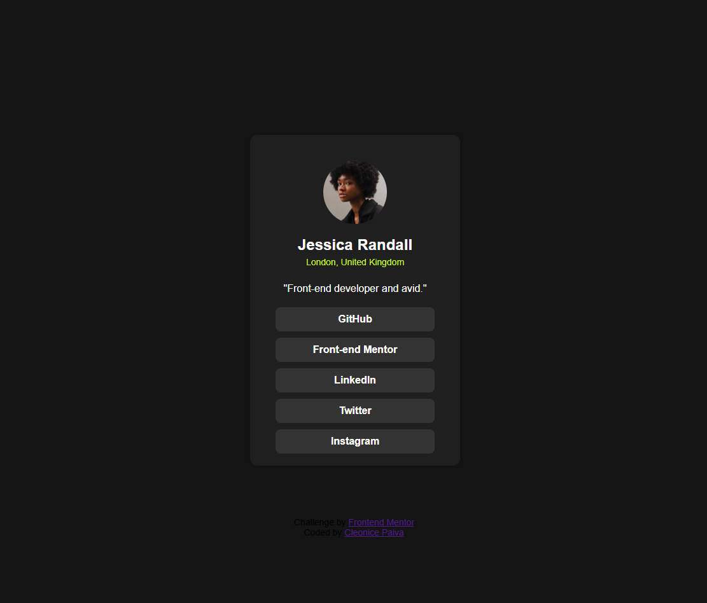

# Frontend Mentor - Social links profile solution

This is a solution to the [Social links profile challenge on Frontend Mentor](https://www.frontendmentor.io/challenges/social-links-profile-UG32l9m6dQ). Frontend Mentor challenges help you improve your coding skills by building realistic projects. 

## Table of contents

- [Overview](#overview)
  - [Screenshot](#screenshot)
  - [Links](#links)
- [My process](#my-process)
  - [Built with](#built-with)
  - [What I learned](#what-i-learned)
- [Author](#author)


## Overview

### Screenshot



## My process

### Built with

- Semantic HTML5 markup
- CSS custom properties
- Flexbox
- CSS Grid
- Mobile-first workflow
- Node.js
- Express.js

### What I learned

Estrutura básica com HTML.

```html
<h2>Jessica Randall</h2>
<p>London, United Kingdom</p>
<a href="https://github.com" target="_blank">GitHub</a>

``` 
Estilizar com CSS, mudando cores, fontes e posicionar elementos.
```css
.card {
  background-color: white;
  padding: 20px;
  border-radius: 10px;
}
.bio {
  color: #6a0dad; /* roxo */
  font-style: italic;
}

```
Centralizar elementos no Flexbox.
```css
body {
  display: flex;
  justify-content: center;
  align-items: center;
  height: 100vh;
}

```
Rodar servidor local com Node.js e Express
```js
const express = require('express');
const app = express();
app.use(express.static(__dirname));
app.listen(3000);

```
Incluir imagens e links externos
```html

<a href="https://www.linkedin.com" target="_blank">LinkedIn</a>

## Author

- Frontend Mentor - [@ Cleonice08](https://www.frontendmentor.io/profile/Cleonice08)
